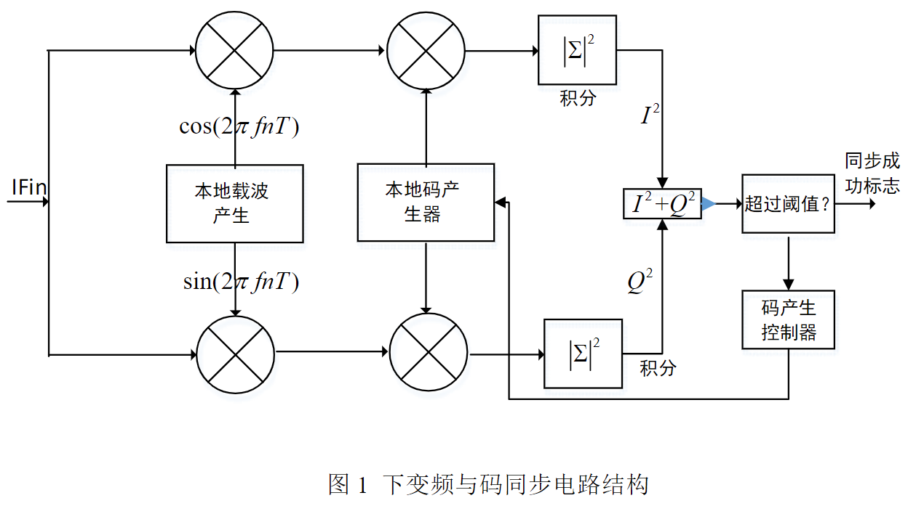
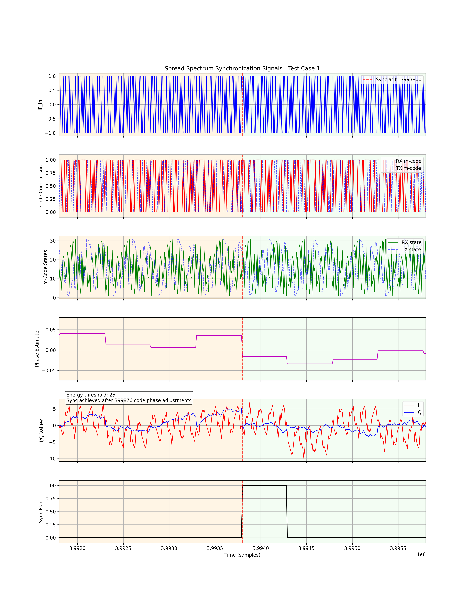
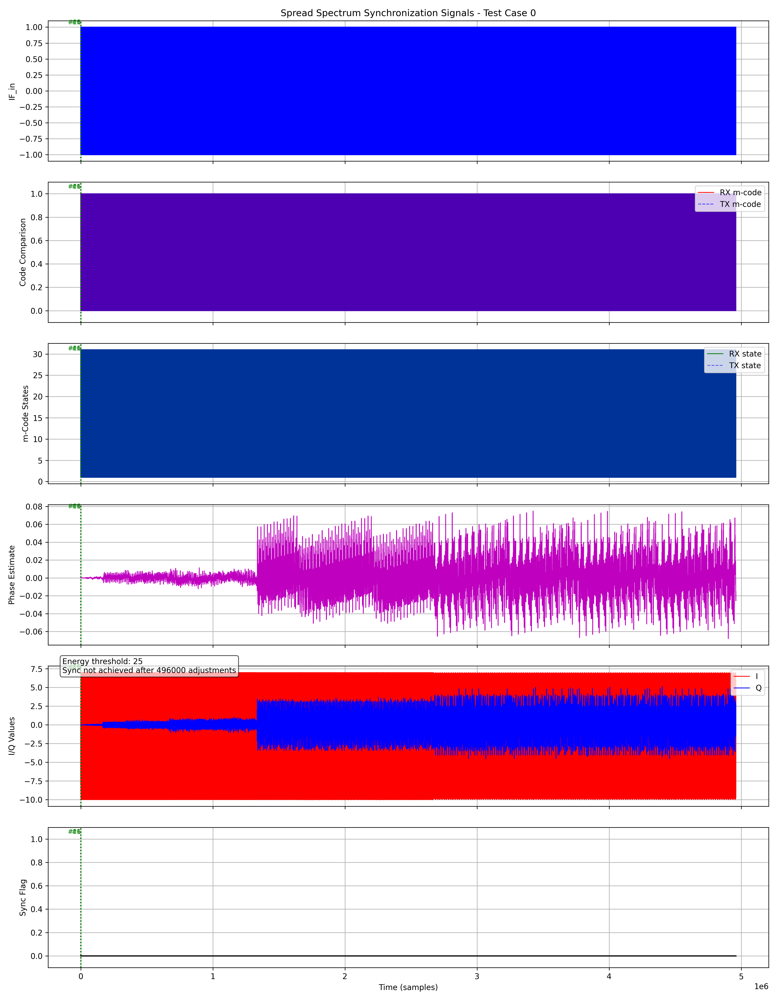

<!--
 * Copyright (c) 2025 by Albresky, All Rights Reserved. 
 * 
 * @Author: Albresky albre02@outlook.com
 * @Date: 2025-03-30 13:18:20
 * @LastEditTime: 2025-03-30 17:23:28
 * @FilePath: /BUPT-EDA-Labs/lab1/README.md
 * 
 * @Description: Lab1 题解
-->

## 🗒️ 题目：简单通信信号同步电路设计

设计一个通信调制信号的同步电路，实现对输入的中频信号的变频和同步。题目不涉及实体硬件电路，所有功能的设计及仿真均在 EDA 开发环境中实现，根据总体设计框图及说明、各个模块电路设计说明、时序说明、仿真结果、资源报告、设计总结和程序源代码评定实验结果。

### 任务一：简单通信信号同步电路设计

设计一个可应用于扩频通信中的扩频同步电路，实现输入的扩频中频信号的下变频和码同步电路。



**输入信号描述**

输入的中频信号 $\text{IF}_{in}$ 使用 2 位精度采样，采样数据使用补码表示。输入的中频信号 $\text{IF}_{in}$ 可由如下表达式表示：

$$ \text{IF}_{in} = f(D \oplus M) \cdot \cos(2\pi f n T + \phi) $$

$$ f(x) = \begin{cases} 1, & x=1 \\ -1, & x=0 \end{cases} $$

其中，符号 $\oplus$ 表示异或操作，$𝑓(x)$ 为**极化函数**，$𝐷$ 为信号中调制的**二进制数据序列**，**数据速率**为 _1kbps_，$𝑀$ 为用于扩频的**伪随机码序列**，由循环长度为 _31_ 的 **$m$ 码**产生。$𝑀$ 的速率 (即**码片速率**) 为 _31kbps_，其每一位所占的时间称为一个**码片周期**。数据位 $𝐷$ 的每一位都与 $𝑀$ 序列的一个循环周期对齐。$𝑓$ 为**载波频率**，$𝑓=124kHz$，$𝑛$ 为**采样序列标号**，$𝑇$ 是**采样周期**，采用载波频率的 4 倍采样。

**信号同步原理**

在信号接收端，中频信号 $\text{IF}_{in}$ 经采样后输入该同步电路，在下变频操作中，使用本地载波产生电路产生的两路本地载波信号 $𝑠_1 (𝑛)$、$𝑠_2(𝑛)$ 与输入信号 $\text{IF}_{in}$ 相乘，得到两路下变频信号 $𝐼$ 和 $𝑄$ (分别为同相支路、正交支路)，其中本地载波信号为

$$ s_1 (n) = \cos(2\pi f n T + \phi) $$
$$ s_2 (n) = \sin(2\pi f n T + \phi) $$

随后，将两路下变频信号与本地码产生器产生的本地码序列进行相关操作 (若本地码为 *1*，则乘以 *1*，若本地码为 *0*，则乘以 *-1*)，并在 $𝑇𝑆=1𝑚s$ 的时长内对相关后的两路信号进行积分，两路信号的积分结果分别为 $I$、$Q$，并求能量信号 $𝑆=𝐼^2+𝑄^2$。

由于 **m 码** 的互相关和自相关特性，当本地码产生器的相位与发送端码产生器产生的序列相位一致时，积分结果 $𝑆$ 可达到最大值，当两者不一致时，$𝑆$ 保持一个较小值。因此，可设定一门限值 $𝑆_{𝑡ℎ}$ 与积分结果 $𝑆$ 相比较，若 $𝑆<𝑆_{𝑡ℎ}$，可认为本地码产生器与发送端码产生器未达到同步状态，此时应将本地码产生器的相位延后一个码片周期，并重新开始积分过程，直至达到 $𝑆 \ge 𝑆_{𝑡ℎ}$，即本地码产生器与发送端码产生器同步的状态。


### 任务二：testbench 编写实验

(1) 设计上述电路的 testbench，调制的电文 $D$ 可自行定义。对设计的电路进行是进行仿真。

(2) 若有必要，可添加其他模块，在设计各模块时，可以添加其他信号，但不要更改设计要求中定义的信号。

## ✍️ 题解


### 一、如何实现积分器的 1ms 积分区间 ?

**1. 码片速率与数据速率的关系：**

码片速率 = 31kHz
数据速率 = 1kHz（从README中给出）
由此可知，每个数据位对应 31 个码片（31kHz ÷ 1kHz = 31）

**2. 采样率的计算：**

载波频率 = 124kHz
采样率 = 4 × 载波频率 = 496kHz

**3. 每个码片的采样点数：**

SAMPLES_PER_CHIP = 采样率 ÷ 码片速率
SAMPLES_PER_CHIP = 496kHz ÷ 31kHz = 16

**4. 1ms 内的总采样点数：**

1ms内的采样点数 = 采样率 × 0.001s = 496kHz × 0.001s = 496 点


**5. 积分时长的等价表达：**

在前面我们已知每个数据位持续 1ms（数据速率 1kHz），每个数据位对应一个完整的 m 码周期（31个码片）。因此，1ms 积分时长 = 31个码片 × 16个采样点/码片 = 496个采样点。

**实现**：积分器通过累积 `SAMPLES_PER_CHIP * CODE_LENGTH = 16 × 31 = 496` 个采样点来实现 1ms 的积分区间。

```cpp
void Integrator(float I_in, float Q_in, float &I_sum, float &Q_sum,
                ap_uint<16> &sample_count, bool &integral_done) {
#pragma HLS INLINE
  I_sum += I_in;
  Q_sum += Q_in;

  if (++sample_count >= SAMPLES_PER_CHIP * CODE_LENGTH) { // 31位码片*16=496
    integral_done = true;
    sample_count = 0;
  } else {
    integral_done = false;
  }
}
```

### 二、如何检测和校正本地载波相位误差


 - 当本地载波与接收信号不同相时，I/Q两路积分结果会产生偏差
 - 采用简单的相位检测器：当I值为正时，Q值反映相位误差；当I值为负时，取Q的负值作为相位误差
 - 使用比例控制算法（P控制器）更新相位估计值

**实现：**

```cpp
// 相位误差计算
float PhaseDetector(float I, float Q) { return (I > 0 ? Q : -Q); }

// 相位跟踪（在顶层函数中）
float phi_error = PhaseDetector(I_accum, Q_accum);
phi_est += KP_GAIN * phi_error;  // KP_GAIN为环路增益(0.01)
```


### 三、 如何调整本地 m 码相位使其与发送端同步？


m 码是 31 位伪随机序列，当本地 m 码与发送端 m 码同相位时，相关积分值达到最大。

使用门限判决法：设定能量门限值（$S_{th}$=25），比较能量值 $S=I^2+Q^2$ 与门限
当 $S \lt S_{th}$ 时，将本地m码相位循环右移一位（延后一个码片周期）；每次调整后重新开始积分过程，直到达到同步。

**实现：**

```cpp
// 码相位控制器
void CodeController(bool sync_flag, ap_uint<5> &m_state) {
#pragma HLS INLINE
  if (!sync_flag) {
    m_state = (m_state >> 1) | (m_state[0] << 4); // 循环右移
  }
}
```


### 四、仿真结果

关键参数的波形如下。

**信号同步成功** 时：



**信号同步失败** 时：

