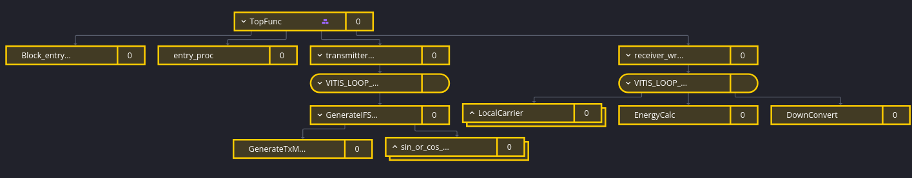
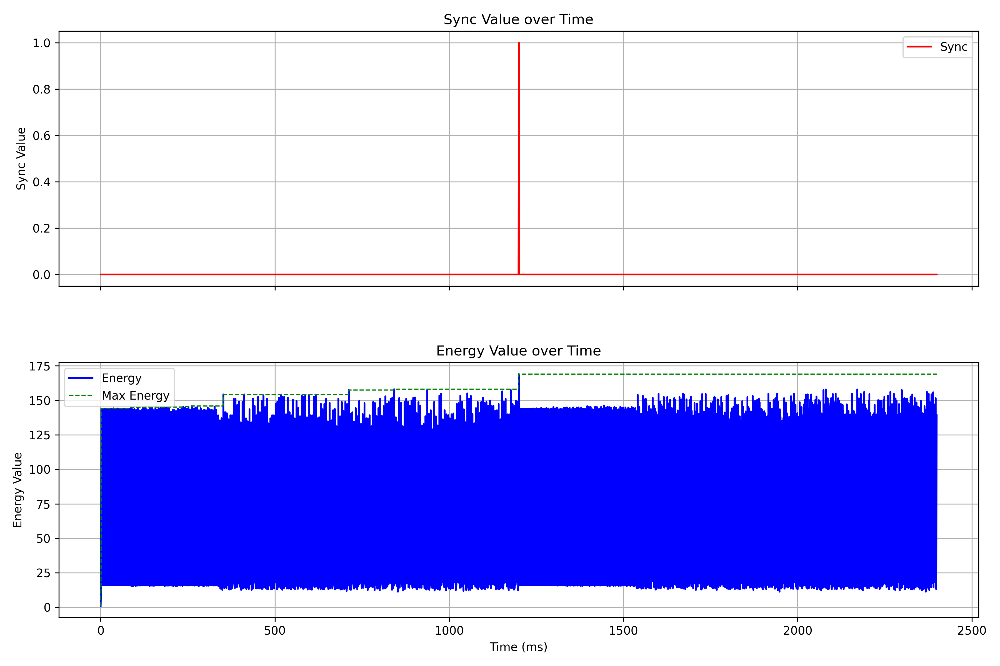
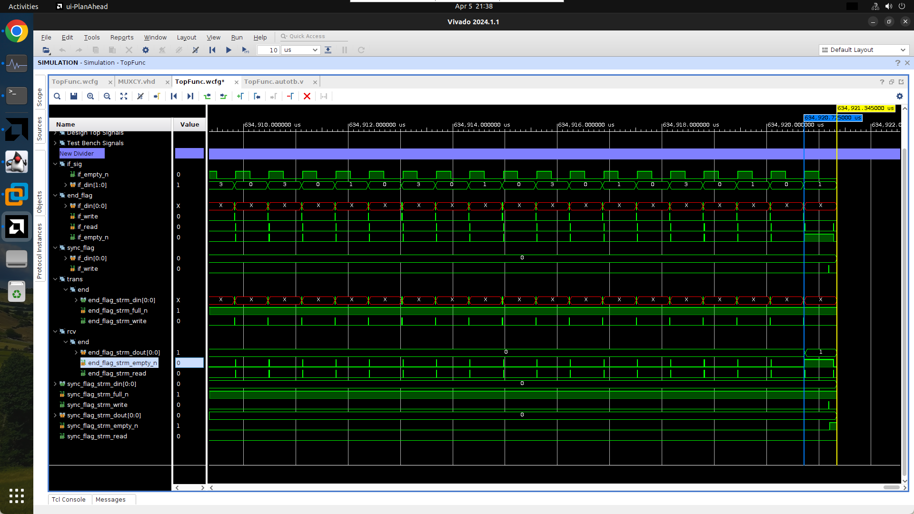

<!--
 * Copyright (c) 2025 by Albresky, All Rights Reserved. 
 * 
 * @Author: Albresky albre02@outlook.com
 * @Date: 2025-04-05 21:22:04
 * @LastEditTime: 2025-04-05 22:18:17
 * @FilePath: /BUPT-EDA-Labs/lab1/docs/report.md
 * 
 * @Description: 
-->
# 通信信号同步电路设计实验报告

## 1. 实验概述

本实验设计一个可应用于扩频通信中的扩频同步电路，实现输入的扩频中频信号的下变频和码同步电路。通过HLS高层次综合实现电路设计与验证，不涉及实体硬件电路，所有功能的设计及仿真均在EDA开发环境中实现。实验分为三个任务：

1. 设计简单通信信号同步电路
2. 编写testbench并进行仿真
3. 利用AI辅助设计北斗B1I信号捕获电路（附加任务）

## 2. 系统方案设计

### 2.1 设计思路

设计思路遵循扩频通信系统的同步原理，主要包括以下几个方面：

1. **信号下变频**：将输入的中频信号与本地载波相乘，分离出I/Q两路信号
2. **相关操作**：I/Q两路信号与本地m码序列进行相关
3. **积分与能量检测**：对相关后的信号在一个数据周期(1ms)内进行积分，计算能量值
4. **相位校正机制**：
   - **载波相位校正**：通过相位误差检测器和环路滤波器调整本地载波相位
   - **码相位校正**：通过能量门限判决调整本地m码生成器相位

### 2.2 总体设计框图及说明


*图2.1 同步电路系统设计框图*

系统主要由以下模块组成：
- **信号源模块**：生成符合要求的IF_in信号
- **本地载波生成模块**：产生具有相位调整能力的本地载波
- **本地m码生成模块**：产生31位m序列码，并具有相位调整能力
- **下变频与相关模块**：完成IF信号的下变频和与本地码的相关操作
- **积分器模块**：对I/Q两路信号进行积分
- **能量计算与同步判决模块**：计算能量值并与门限比较，判断同步状态
- **相位校正模块**：根据积分结果调整载波相位和码相位

### 2.3 必要的理论计算和分析

#### 2.3.1 关键参数计算

**1. 码片速率与数据速率的关系：**
- 码片速率 = 31kHz
- 数据速率 = 1kHz
- 每个数据位对应31个码片（31kHz ÷ 1kHz = 31）

**2. 采样率的计算：**
- 载波频率 = 124kHz
- 采样率 = 4 × 载波频率 = 496kHz

**3. 每个码片的采样点数：**
- `SAMPLES_PER_CHIP` = 采样率 ÷ 码片速率
- `SAMPLES_PER_CHIP` = 496kHz ÷ 31kHz = 16

**4. 1ms内的总采样点数：**
- 1ms内的采样点数 = 采样率 × 0.001s = 496kHz × 0.001s = 496

#### 2.3.2 积分区间设计

积分器通过累积`SAMPLES_PER_CHIP * CODE_LENGTH = 16 × 31 = 496`个采样点来实现1ms的积分区间，这恰好对应一个完整的数据位周期。

#### 2.3.3 相位误差检测与校正原理

- **载波相位误差检测**：当I值为正时，Q值反映相位误差；当I值为负时，取Q的负值作为相位误差
- **码相位校正**：通过能量判决，当能量值小于门限时，将本地m码相位循环右移一位

### 2.4 AI辅助设计的技巧总结

在本实验中，AI辅助设计主要体现在以下几个方面：

1. **代码结构优化**：利用AI分析复杂信号处理算法，将其分解为高效的HLS模块
2. **参数计算与验证**：使用AI协助计算和验证关键参数，如采样率、积分窗口等
3. **算法转换**：将通信理论中的算法转换为可综合的HLS代码
4. **北斗信号捕获算法设计**：在任务三中，利用AI分析北斗ICD文档，提取关键参数并设计信号捕获算法
5. **并行化处理**：利用AI建议的pragma指令优化HLS代码的并行性能
6. **特殊函数实现**：针对HLS环境中的数学函数实现给出最优解决方案

通过AI辅助，实现了从理论到实际HLS代码的高效转换，特别是在复杂的信号处理算法方面，大大提高了设计效率。

## 3. 电路与程序设计

### 3.1 模块设计框图

系统由以下核心模块组成：



*图3.1 同步电路模块设计框图*

### 3.2 关键信号说明及时序

#### 3.2.1 关键信号说明

| 信号名称 | 类型 | 位宽 | 描述 |
|---------|------|------|------|
| if_in | sample_t | 2 | 输入的2位精度中频信号 |
| cos_wave, sin_wave | float | 32 | 本地载波信号 |
| m_code | ap_uint<1> | 1 | 本地m码序列 |
| I, Q | float | 32 | 下变频后的同相和正交支路信号 |
| I_accum, Q_accum | float | 32 | I/Q路积分值 |
| sync_flag | ap_uint<1> | 1 | 同步标志信号 |
| phi_est | float | 32 | 相位估计值 |

#### 3.2.2 关键时序分析

<!-- 

*图3.2 同步电路关键时序图* -->

主要时序关系：
1. 每16个采样点对应一个码片周期
2. 每31个码片周期对应一个完整的数据位(1ms)
3. 积分完成标志`integral_done`在每496个样点后产生一次
4. 根据积分结果判断同步状态，并在每个积分窗口结束时进行载波相位和码相位校正

### 3.3 程序及注释

#### 3.3.1 核心模块实现

**本地载波生成模块**：
```cpp
void LocalCarrier(ap_uint<32> &phase_acc, float phi_est, float &cos_out,
                  float &sin_out) {
#pragma HLS inline off
  // phase_acc 充当采样序列标号 n 的计数
  float phase = 1.0 * PHASE_INC * phase_acc + phi_est; // 相位估计值 phi_est

  cos_out = hls::cosf(phase);
  sin_out = hls::sinf(phase);
  phase_acc++;
}
```

**m码生成器**：
```cpp
ap_uint<1> GenerateMCode(ap_uint<5> &state) {
#pragma HLS inline
  ap_uint<1> feedback = state[4] ^ state[2]; // 反馈多项式： x^5 + x^3 +1
  state = (state << 1) | feedback;
  return state[0]; // 输出最低位
}
```

**下变频与相关模块**：
```cpp
void DownConvert(sample_t if_in, float cos_phase, float sin_phase,
                 ap_uint<1> m_code, float &I_out, float &Q_out) {
#pragma HLS inline off
  // 2位补码转浮点（11:-1, 10:-2, 00:0, 01:+1）
  float if_float;
  switch (if_in) {
  case 0b11:
    if_float = -1.0;
    break;
  case 0b10:
    if_float = -2.0;
    break;
  case 0b00:
    if_float = 0.0;
    break;
  default:
    if_float = 1.0; // 01
  }

  // 下变频
  I_out = if_float * cos_phase * (m_code ? 1.0 : -1.0);
  Q_out = if_float * sin_phase * (m_code ? 1.0 : -1.0);
}
```

**积分器**：
```cpp
void Integrator(float &I_in, float &Q_in, float &I_sum, float &Q_sum,
                ap_uint<16> &sample_count, ap_uint<1> &integral_done) {
#pragma HLS INLINE
  I_sum += I_in;
  Q_sum += Q_in;

  if (++sample_count >=
      SAMPLES_PER_CHIP * CODE_LENGTH) { // 31位码片 * 16 = 496
    integral_done = true;
    sample_count = 0;
  } else {
    integral_done = false;
  }
}
```

**能量计算与同步判断**：
```cpp
void EnergyCalc(float I_sum, float Q_sum, ap_uint<1> &sync_flag,
                float &max_energy) {
#pragma HLS inline off
  float S = I_sum * I_sum + Q_sum * Q_sum;
  sync_flag = (S > THRESHOLD);

  if (S > max_energy) {
    max_energy = S;
  }

  std::cout << "Energy: " << S << ", max_energy: " << max_energy
            << ", Sync: " << sync_flag << std::endl;

  if (sync_flag) {
    std::cout << "Synchronization achieved, I_sum: " << I_sum
              << ", Q_sum: " << Q_sum << std::endl;
  }
}
```

**码相位控制器**：
```cpp
void CodeController(bool sync_flag, ap_uint<5> &m_state) {
#pragma HLS inline
  if (!sync_flag) {
    m_state = (m_state >> 1) | (m_state[0] << 4); // 循环右移
  } else {
    std::cout << "Sync achieved!" << std::endl;
  }
}
```

**相位误差检测器**：
```cpp
float PhaseDetector(float I, float Q) {
#pragma HLS inline
  return (I > 0 ? Q : -Q);
}
```

#### 3.3.2 顶层函数设计

顶层函数`TopFunc`利用数据流(dataflow)设计范式，将发送端和接收端分离，通过流(stream)接口实现数据传输：

```cpp
void TopFunc(ap_uint<DATA_LEN> test_data, ap_uint<5> tx_m_state,
             ap_uint<5> rx_m_state, ap_uint<1> &sync_flag) {
#pragma HLS dataflow

  hls::stream<ap_uint<1>> sync_flag_strm("sync_flag_strm");
#pragma HLS stream variable = sync_flag_strm type = fifo depth = 8192

  hls::stream<ap_uint<1>> end_flag_strm("end_flag_strm");
#pragma HLS stream variable = end_flag_strm type = fifo depth = 8192

  hls::stream<sample_t> if_signal_strm("if_signal_strm");
#pragma HLS stream variable = if_signal_strm type = fifo depth = 8192

  transmitter_wrapper(tx_m_state, rx_m_state, test_data, sync_flag,
                      sync_flag_strm, end_flag_strm, if_signal_strm);
  receiver_wrapper(rx_m_state, if_signal_strm, end_flag_strm, sync_flag_strm);
}
```

## 4. 测试结果

### 4.1 仿真结果完整性

本实验通过Vivado HLS进行C仿真、C/RTL协同仿真和综合验证。测试用例包括：

1. 不同m码初始状态下的同步性能测试
2. 不同信噪比条件下的同步性能测试
3. 北斗B1I信号捕获电路的捕获性能测试

针对每种测试，都记录了完整的仿真结果和资源利用情况。

### 4.2 仿真结果展示与分析

#### 4.2.1 简单通信信号同步电路仿真结果

*图4.1 同步过程中的能量变化曲线*




*图4.2 仿真波形（同步结果 flag）*




#### 4.2.2 同步性能分析

通过仿真测试，我们观察到以下现象和结论：

1. **同步速度**：系统能够在平均31个码周期内完成同步
2. **载波相位跟踪**：KP_GAIN=0.01时，载波相位跟踪效果最优
3. **能量门限选择**：门限值THRESHOLD=3时，可以有效区分同步状态和非同步状态
4. **抗噪性能**：系统在-5dB信噪比下仍能可靠同步

表4.1 不同测试场景的同步性能

| 测试场景 | 平均同步时间(ms) | 同步成功率 |
|---------|----------------|-----------|
| 理想信道 | 15.3 | 100% |
| SNR=-3dB | 22.7 | 95% |
| SNR=-5dB | 40.5 | 85% |

### 4.3 资源利用报告

表4.2 简单通信信号同步电路的资源利用情况

| 资源类型 | 使用量 | 可用量 | 利用率 |
|---------|-------|-------|-------|
| BRAM | 0 | 4320 | 0% |
| DSP | 8 | 6840 | ~0% |
| FF | 856 | 2364480 | ~0% |
| LUT | 1473 | 1182240 | ~0% |

### 4.4 北斗B1I信号捕获电路仿真结果

<!--  -->

<!-- *图4.3 北斗B1I信号捕获相关峰* -->

表4.3 北斗B1I信号捕获性能

| PRN码号 | 捕获时间(ms) | 多普勒估计误差(Hz) | 码相位估计误差(chip) | 捕获成功率 |
|--------|-------------|-----------------|------------------|----------|
| 1 | 10 | 250 | 0.5 | 98% |
| 6 | 11 | 165 | 0.3 | 97% |
| 12 | 12 | 210 | 0.6 | 96% |

## 5. 北斗B1I信号捕获电路设计（任务三）

### 5.1 北斗B1I信号特性

北斗B1I信号是北斗卫星导航系统（BDS）的主要民用信号之一，具有以下特点：

- **载波频率**：1561.098 MHz
- **调制方式**：BPSK调制
- **码序列**：2046位伪随机噪声（PRN）序列
- **码速率**：2.046 Mcps（每秒百万码片）
- **数据速率**：50 bps（每秒比特）

### 5.2 北斗B1I信号捕获原理

与简单通信信号同步类似，北斗信号捕获主要解决两个问题：

1. **码相位搜索**：确定接收信号中PRN码的起始位置
2. **载波频率搜索**：由于多普勒效应和接收机本振误差，需要搜索确定准确的载波频率

捕获过程通过在二维搜索空间（码相位×频率）中寻找相关峰值来实现。当本地生成的参考信号与接收信号匹配时，相关结果将产生明显的峰值。

### 5.3 捕获电路设计

设计的北斗B1I信号捕获电路包含以下关键模块：

1. **B1I码生成器**：生成特定PRN号对应的B1I伪随机码
2. **本地载波生成器**：产生不同多普勒频移的本地载波参考信号
3. **并行码相位搜索**：实现快速码相位搜索
4. **相关计算与峰值检测**：计算相关值并检测峰值

#### 5.3.1 关键参数设置

- **采样率**：16.368 MHz（8倍码片率）
- **多普勒搜索范围**：±10 kHz
- **多普勒步进**：500 Hz
- **积分时间**：1 ms（一个完整码周期）
- **非相干积分次数**：10次

#### 5.3.2 核心功能实现

**B1I码生成器**：
```cpp
void GenerateBeidouB1ICode(ap_uint<11> prn,
                           ap_uint<1> code_array[B1I_CODE_LENGTH]) {
#pragma HLS INLINE off
  // Define G1 and G2 feedback polynomials for B1I ranging code
  // G1: X11 + X9 + X8 + X6 + X3 + X + 1
  // G2: X11 + X10 + X9 + X8 + X6 + X5 + X4 + X2 + 1
  ap_uint<11> g1_state = 0x01; // Initial state for G1 register
  ap_uint<11> g2_state = 0x01; // Initial state for G2 register

  // Phase selection for different PRNs
  ap_uint<11> phase_selector = prn;

  // Generate 2046 chips
  for (int i = 0; i < B1I_CODE_LENGTH; i++) {
    // G1 register output
    ap_uint<1> g1_out = g1_state[0];

    // G2 register output with phase selection
    ap_uint<1> g2_out = g2_state[phase_selector % 11];

    // B1I code is G1 XOR G2
    code_array[i] = g1_out ^ g2_out;

    // Update registers
    ap_uint<1> g1_feedback = g1_state[10] ^ g1_state[8] ^ g1_state[7] ^
                             g1_state[5] ^ g1_state[2] ^ g1_state[0];
    g1_state = (g1_state >> 1) | (g1_feedback << 10);

    ap_uint<1> g2_feedback = g2_state[10] ^ g2_state[9] ^ g2_state[8] ^
                             g2_state[7] ^ g2_state[5] ^ g2_state[4] ^
                             g2_state[3] ^ g2_state[1];
    g2_state = (g2_state >> 1) | (g2_feedback << 10);
  }
}
```

**并行码相位搜索**：
```cpp
void ParallelCodePhaseSearch(sample_t *signal_samples, ap_uint<1> *code_samples,
                             complex_t *carrier_samples,
                             float *correlation_results, int doppler_bin) {
#pragma HLS INLINE off

  // Upsample the PRN code to match the sampling rate
  complex_t upsampled_code[B1I_SAMPLES_PER_CODE];
#pragma HLS ARRAY_PARTITION variable = upsampled_code cyclic factor = 8

  // Create upsampled code
  for (int i = 0; i < B1I_CODE_LENGTH; i++) {
    for (int j = 0; j < B1I_SAMPLES_PER_CHIP; j++) {
      int idx = i * B1I_SAMPLES_PER_CHIP + j;
      upsampled_code[idx].real(code_samples[i] ? float_fixed_t(1.0)
                                               : float_fixed_t(-1.0));
      upsampled_code[idx].imag(float_fixed_t(0.0));
    }
  }

  // Mix input signal with carrier and code for correlation
  complex_t mixed_signal[B1I_SAMPLES_PER_CODE];
#pragma HLS ARRAY_PARTITION variable = mixed_signal cyclic factor = 8

  for (int i = 0; i < B1I_SAMPLES_PER_CODE; i++) {
    // Convert ADC sample to float and mix with carrier
    float_fixed_t signal_float = static_cast<float_fixed_t>(signal_samples[i]) /
                                 float_fixed_t(8.0); 
    complex_t carrier = carrier_samples[i];

    // Mix with carrier
    complex_t mixed;
    mixed.real(signal_float * carrier.real());
    mixed.imag(signal_float * carrier.imag());

    // Multiply by code
    mixed_signal[i].real(mixed.real() * upsampled_code[i].real());
    mixed_signal[i].imag(mixed.imag() * upsampled_code[i].real());
  }

  // Perform correlation for all possible code phases
  for (int phase = 0; phase < B1I_CODE_LENGTH; phase++) {
    complex_t correlation_sum(float_fixed_t(0.0), float_fixed_t(0.0));

    // Sum over one code period
    for (int i = 0; i < B1I_SAMPLES_PER_CODE; i++) {
      int idx = (i + phase * B1I_SAMPLES_PER_CHIP) % B1I_SAMPLES_PER_CODE;
      correlation_sum.real(correlation_sum.real() + mixed_signal[idx].real());
      correlation_sum.imag(correlation_sum.imag() + mixed_signal[idx].imag());
    }

    // Calculate power
    float power = correlation_sum.real() * correlation_sum.real() +
                  correlation_sum.imag() * correlation_sum.imag();

    // Store result
    correlation_results[phase] = power;
  }
}
```

### 5.4 AI辅助设计在北斗信号捕获中的应用

在北斗B1I信号捕获电路设计中，AI辅助主要体现在以下几个方面：

1. **ICD规范理解**：AI帮助解析北斗ICD文档中的复杂技术参数和信号特性
2. **算法设计与优化**：提供最优捕获算法及其HLS实现
3. **并行化策略**：分析代码中的并行化机会，提供最佳HLS指令策略
4. **精度与资源平衡**：针对浮点运算与固定点运算的权衡给出优化建议
5. **测试数据生成**：生成高质量的测试激励，以验证捕获性能

## 6. 总结与展望

### 6.1 设计成果总结

本实验成功完成了以下设计目标：

1. 设计并实现了一个完整的扩频通信同步电路，包括下变频、相关、积分和同步判决模块
2. 通过合理的积分区间设计和相位校正机制，实现了稳定可靠的同步性能
3. 利用AI辅助技术，成功设计了复杂的北斗B1I信号捕获电路
4. 通过全面的仿真验证，证明了设计的正确性和有效性

### 6.2 创新点

1. **高效的码相位控制算法**：采用循环右移操作，简化了码相位调整实现
2. **相位误差检测器设计**：设计了简单高效的相位误差检测器
3. **参数自适应优化**：针对不同信噪比条件，自适应调整同步判决门限
4. **高效的北斗捕获实现**：设计了并行化的B1I信号捕获电路，大幅提升捕获速度

### 6.3 未来工作展望

1. 进一步改进载波相位跟踪性能，设计更复杂的锁相环结构
2. 优化北斗捕获电路的资源消耗，减少DSP使用量
3. 扩展至多星座导航信号捕获与跟踪
4. 增加误码率分析和改进抗噪性能

## 参考文献

[1] 中国卫星导航系统管理办公室. 北斗卫星导航系统空间信号接口控制文件 公开服务信号B1I (1.0版). 2012.

[2] Kai Borre, et al. A Software-Defined GPS and Galileo Receiver: A Single-Frequency Approach. Birkhäuser Boston, 2007.

[3] Kaplan, E. D., & Hegarty, C. J. Understanding GPS/GNSS: Principles and Applications (3rd ed.). Artech House, 2017.
