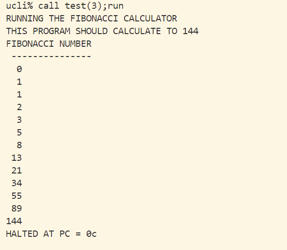
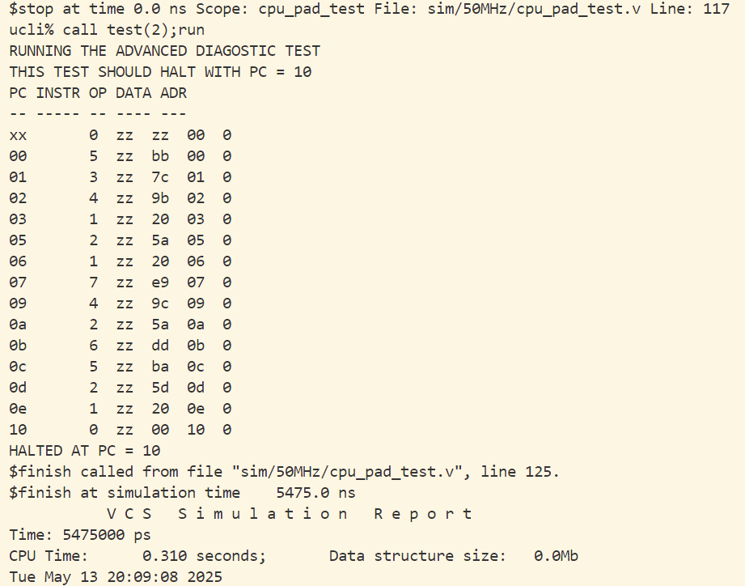

# 实验二：简单处理器 (CPU) 的逻辑综合实验

## 一、实验概述与目标

本实验对一个简单的 8 位 CPU 进行逻辑综合和时序验证，通过将 RTL 代码转换为门级网表，并在不同时钟频率下进行时序分析和功能验证，可以帮助我理解 ASIC 设计流程中逻辑综合环节的关键步骤。

主要实验目标：

1. 理解 CPU 的基本结构和工作原理
2. 掌握使用 Synopsys Design Compiler 进行逻辑综合的方法
3. 分析和解决不同频率下的时序约束问题
4. 学习 SDF 文件的生成和反标方法
5. 比较综合前后电路功能的一致性

## 二、源码结构

- `cpu`
  - 包含简单 CPU 的 RTL 代码和测试文件。
  - 主要模块包括：
    - `cpu.v`：CPU 顶层模块，集成了控制单元、ALU、寄存器、程序计数器等子模块。
    - `control.v`：控制单元模块，负责生成控制信号，采用 8 个时钟周期的格雷编码状态机实现。
    - `alu.v`：算术逻辑单元模块，执行基本的算术和逻辑运算，如加法、与、异或等操作。
    - `register.v`：通用寄存器模块，用于存储数据，由 8 个 D 触发器组成。
    - `counter.v`：程序计数器模块，用于生成指令地址，支持异步复位和同步置位。
    - `mem.v`：存储器模块，模拟数据存储，实现了读写功能。
    - `mux.v` 和 `scale_mux.v`：多路选择器模块，用于信号选择。
    - `dffr.v`：D 触发器模块，用于时序逻辑，采用门级描述实现。
    - `clock.v`：时钟生成模块，用于仿真时钟信号。
    - `cpu_pad.v`：CPU 的 PAD 封装模块，用于逻辑综合后的顶层设计。
    - `cpu_test.v` 和 `cpu_pad_test.v`：测试模块，用于验证 RTL 和门级网表的功能。
- `syn`
  - 包含逻辑综合的工程目录。
  - 主要内容包括：
    - `scripts/dc_scripts.tcl`：逻辑综合的主脚本模板，定义了设计约束和综合命令。
    - `scripts/gen_tcl.sh`：用于生成不同频率下的综合脚本。
    - `.synopsys_dc.setup`：Synopsys DC 的配置文件，设置工作环境和参数。
    - `Makefile`：用于自动化逻辑综合和仿真工程的生成，支持多种频率下的综合和仿真。
- `sim`
  - 仿真工程目录 (逻辑综合后，通过 `make sim_all` 生成)。
  - 包含门级网表和 SDF 文件的仿真工程。

## 三、CPU 指令架构

该 CPU 实现了一个简化的指令集，包含以下 8 条基本指令：

| 操作码 | 助记符 | 描述              |
| --- | --- | --------------- |
| 000 | HLT | 停止执行            |
| 001 | SKZ | 若累加器为零则跳过下一条指令  |
| 010 | ADD | 将存储单元内容与累加器相加   |
| 011 | AND | 将存储单元内容与累加器按位与  |
| 100 | XOR | 将存储单元内容与累加器按位异或 |
| 101 | LDA | 将存储单元内容加载到累加器   |
| 110 | STO | 将累加器内容存入存储单元    |
| 111 | JMP | 无条件跳转到指定地址      |

指令格式为 8 位，高 3 位为操作码，低 5 位为地址。

## 四、实验要求及报告

### 4.1 CPU RTL 验证

利用 VCS 和已有的测试文件，对 CPU 进行测试，验证 RTL 级 CPU 的正确性，并解决验证过程中遇到的问题。

> 注：在 `cpu` 工作目录下使用 `make` 命令对 CPU 进行验证，并根据提示执行相应的命令运行测试文件对 CPU 进行测试。

- **修改参考示例存在的 bug**
  - `.tcl` 脚本中存在的语法错误已修复，主要是库名和路径的正确配置。
  - `rtl.f` 文件中缺失的 RTL 声明已补充，确保所有模块文件被正确包含。
  - `cpu.v` 中 _halt_ 信号未拉出的问题已解决，确保 PAD 后的 CPU 能在仿真时正确中断。
  - `scale_mux.v` 中的参数名称从 `WIDTH` 修改为 `size`，以与实际调用匹配。

- **RTL 级 CPU 验证结果**
  - 测试 1 (基础诊断测试)
    - 
    - 验证结果显示 CPU 正确执行了基本指令集，并在 PC=17 处正确停止。
  - 测试 2 (进阶诊断测试)
    - 
    - 验证了更复杂的指令序列，包括条件跳转和数据处理，在 PC=10 处正确停止。
  - 测试 3 (斐波那契数列计算)
    - 
    - 成功计算并输出了斐波那契数列，最终计算到 144。

### 4.2 CPU PAD 逻辑综合结果时序验证

对 CPU 添加输入输出 PAD，编写脚本，利用 EDA 工具和工艺库文件对生成的顶层文件进行逻辑综合，生成门级网表和 SDF 文件。分别设置时钟频率 150MHz、50MHz、20MHz，分析逻辑综合结果是否满足时序要求。

#### 逻辑综合流程

1. **脚本生成**：
   - 使用 `scripts/gen_tcl.sh` 脚本生成不同频率下的综合脚本。
   - 具体实现是根据频率参数修改 `create_clock -period` 值。
   - 示例命令：`make syn_all`。

2. **逻辑综合**：
   - 在 `syn` 目录下运行 `dc_shell`，执行生成的 `.tcl` 脚本。
   - 关键步骤包括：
     - 读入 RTL 设计文件
     - 设置时钟和约束
     - 进行综合优化 (`compile_ultra`)
     - 生成报告和输出文件
   - 输出文件包括：
     - 门级网表 (`.v` 文件)
     - 时序约束文件 (`.sdc` 文件)
     - 标准延迟格式文件 (`.sdf` 文件)

3. **结果验证**：
   - 分析生成的时序报告，确保所有频率下的时序指标均满足要求。
   - 核心指标为 Slack 值，必须大于 0 才表示满足时序约束。

#### 综合结果

- **门级网表和 SDF 文件**
  - 
  - 成功生成了各频率下的综合产物，包括网表、约束和延迟文件。

- **时序验证结果**
  - **20 MHz** (Slack=19.60 > 0)
    - 
    - 时钟周期 50ns，关键路径延迟约 30.4ns，时序裕量充足。
  - **50 MHz** (Slack=4.58 > 0)
    - 
    - 时钟周期 20ns，关键路径延迟约 15.42ns，时序裕量适中。
  - **150 MHz** (Slack=0.02 > 0)
    - 
    - 时钟周期 6.67ns，关键路径延迟约 6.65ns，时序裕量非常紧张，但仍然满足约束。

### 4.3 反标 SDF 后的 CPU 功能验证

利用之前的测试文件，反标 SDF 后，对逻辑综合生成的门级网表 (150MHz、50MHz、20MHz) 进行功能验证，并对门级验证的结果进行分析。

#### 仿真流程

1. **仿真工程生成**：
   - 使用 `make sim_all` 命令生成各频率下的仿真工程。
   - 每个仿真工程包含：
     - 门级网表 (重命名为 `cpu_pad_mapped.v`)
     - 原始 RTL 的 `cpu_pad.v` 作为接口
     - SDF 文件 (用于时序反标)
     - 测试文件和其他必要模块

2. **SDF 反标**：
   - 在仿真中加载对应频率的 SDF 文件，进行时序仿真。
   - 通过 `$sdf_annotate` 系统任务实现 SDF 文件的加载。
   - 基于预处理宏 `SDF_150MHz`、`SDF_50MHz` 和 `SDF_20MHz` 选择不同频率。

3. **功能验证**：
   - 执行测试程序，验证门级网表的功能正确性。
   - 对比 RTL 和门级网表的仿真结果，确保一致性。

#### 仿真结果

- **20 MHz**
  - 测试 1
    - 
    - 基础诊断测试在 20MHz 下成功执行，功能与 RTL 一致。
  - 测试 2
    - 
    - 进阶诊断测试在 20MHz 下成功执行，功能与 RTL 一致。
  - 测试 3
    - 
    - 斐波那契数列计算在 20MHz 下成功执行，结果与 RTL 一致。

- **50 MHz**
  - 测试 1
    - 
    - 基础诊断测试在 50MHz 下成功执行，功能与 RTL 一致。
  - 测试 2
    - 
    - 进阶诊断测试在 50MHz 下成功执行，功能与 RTL 一致。
  - 测试 3
    - 
    - 斐波那契数列计算在 50MHz 下成功执行，结果与 RTL 一致。

- **150 MHz**
  - 测试 1
    - 
    - 基础诊断测试在 150MHz 下成功执行，功能与 RTL 一致。
  - 测试 2
    - 
    - 进阶诊断测试在 150MHz 下成功执行，功能与 RTL 一致。
  - 测试 3
    - 
    - 斐波那契数列计算在 150MHz 下成功执行，结果与 RTL 一致。

## 五、文件说明

### 5.1 Verilog 模块

- **`cpu.v`**：CPU 顶层模块，集成了所有子模块，实现了指令获取、译码和执行的流程。
- **`control.v`**：控制单元，基于 8 状态格雷码状态机实现，生成各种控制信号。
- **`alu.v`**：算术逻辑单元，实现了 8 种基本运算，包括数据传递、算术运算和逻辑运算。
- **`register.v`**：通用寄存器，用于数据存储，通过例化多个 D 触发器实现。
- **`counter.v`**：程序计数器，实现了复位、置数和递增功能，用于指令地址生成。
- **`mem.v`**：存储器，模拟数据存储，支持读写操作，采用数组实现。
- **`mux.v` 和 `scale_mux.v`**：多路选择器，用于信号选择，支持不同位宽。
- **`dffr.v`**：D 触发器，用于时序逻辑，采用门级描述实现。
- **`clock.v`**：时钟生成模块，产生 50MHz 的时钟信号用于仿真。
- **`cpu_pad.v`**：CPU 的 PAD 封装模块，连接内部 CPU 与外部接口。
- **`cpu_test.v` 和 `cpu_pad_test.v`**：测试模块，分别用于 RTL 和门级网表测试。

### 5.2 脚本和配置文件

- **`dc_scripts.tcl`**：综合主脚本模板，定义了读取设计、施加约束、运行综合和生成报告等步骤。
- **`gen_tcl.sh`**：脚本生成工具，根据频率参数修改时钟周期，生成不同频率的综合脚本。
- **`.synopsys_dc.setup`**：DC 配置文件，设置了工作环境和常用命令别名。
- **`Makefile`**：自动化脚本，支持 RTL 仿真、多频率综合和门级仿真。

### 5.3 测试文件

- **`CPUtest1.dat` 至 `CPUtest5.dat`**：测试程序，用于验证 CPU 功能。
  - 测试 1：基础诊断测试
  - 测试 2：进阶诊断测试
  - 测试 3：斐波那契数列计算
  - 测试 4：计数器程序
  - 测试 5：$2^n$ 计算程序

## 六、实验分析与结论

### 6.1 时序分析

从综合结果可以看出，随着时钟频率的提高，时序裕量逐渐减小：

- 20MHz：Slack = 19.60ns，时序裕量充足
- 50MHz：Slack = 4.58ns，时序裕量适中
- 150MHz：Slack = 0.02ns，时序裕量极小

这表明该 CPU 设计在 150MHz 下已经接近其极限工作频率。若要继续提高频率，需要进行进一步的时序优化，如重构关键路径、优化组合逻辑或增加流水线等。

### 6.2 功能验证

通过对比 RTL 仿真和门级仿真结果，我们可以确认：

1. 逻辑综合过程保留了设计的功能正确性
2. SDF 反标对时序的影响未导致功能错误
3. 所有频率下的门级网表均能正确执行指令序列

### 6.3 实验收获

通过本实验，我们掌握了：

1. CPU 基本结构及工作原理
2. 使用 Design Compiler 进行逻辑综合的方法
3. 时序约束的设置和分析技巧
4. SDF 文件的生成和反标应用
5. 理解了时钟频率、关键路径和时序裕量之间的关系

## 七、使用说明

1. **RTL 验证**：
   - 进入 `cpu` 目录，运行 `make` 命令。
   - 按提示运行 `call test(N);run` 执行测试，其中 N 为测试编号 (1-5)。
   - 查看仿真结果和波形。

2. **逻辑综合**：
   - 在根目录运行 `make syn_all` 执行所有频率的综合。
   - 单独频率综合可使用 `make synth_XXMHz`，如 `make synth_150MHz`。
   - 查看 `syn/logs` 中的综合日志和 `syn/rpt` 中的报告。

3. **门级仿真**：
   - 在根目录运行 `make sim_all` 生成所有频率的仿真工程。
   - 进入 `sim/<频率>` 目录，运行 `./sim_<频率>` 进行仿真。
   - 按提示运行 `call test(N);run` 执行测试，查看结果和波形。

4. **清理工程**：
   - 运行 `make clean` 清理所有生成文件。
