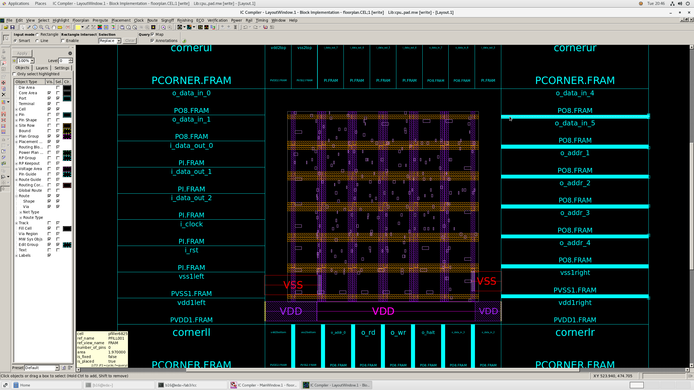
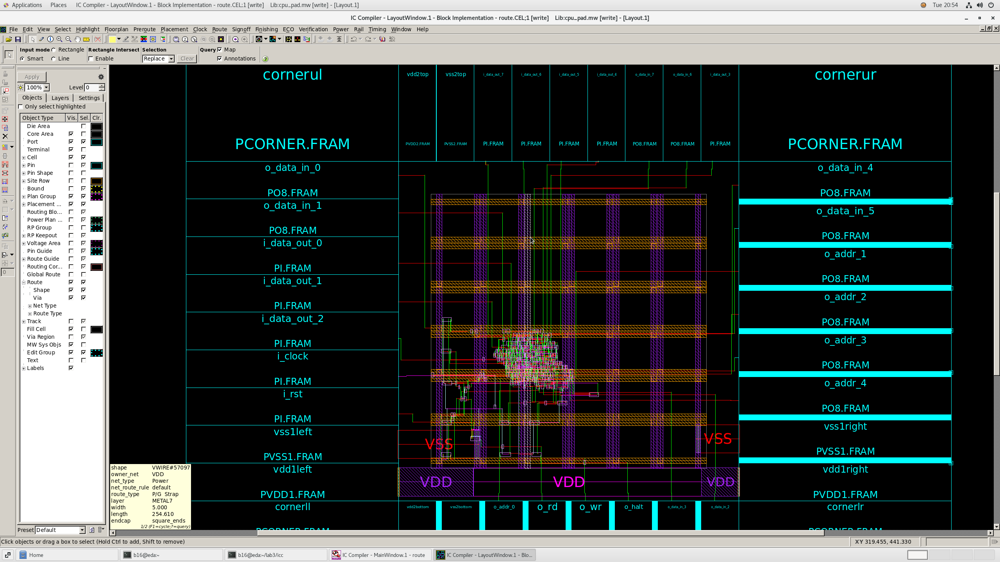
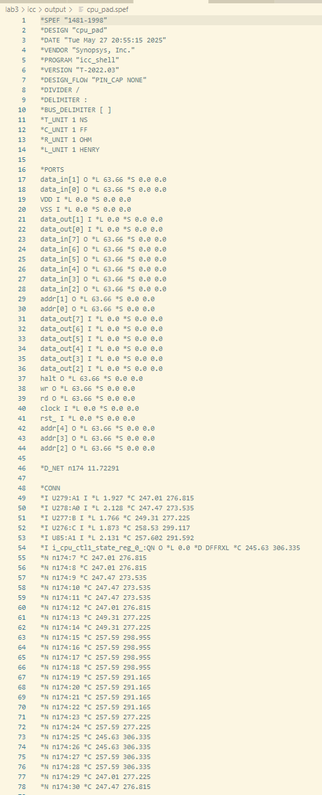
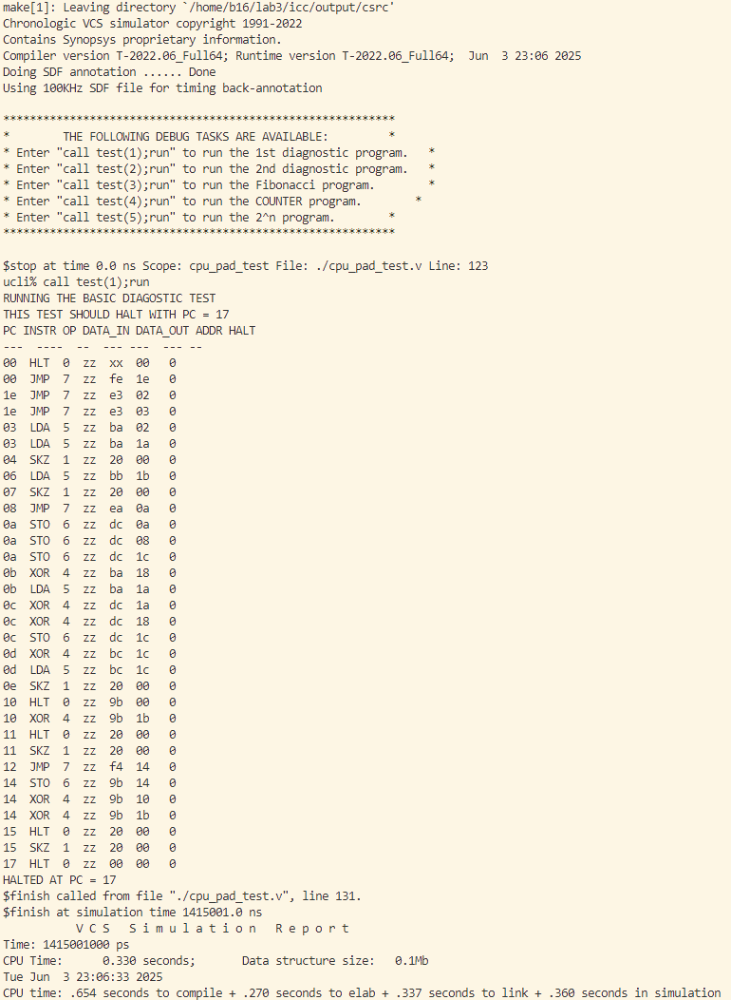
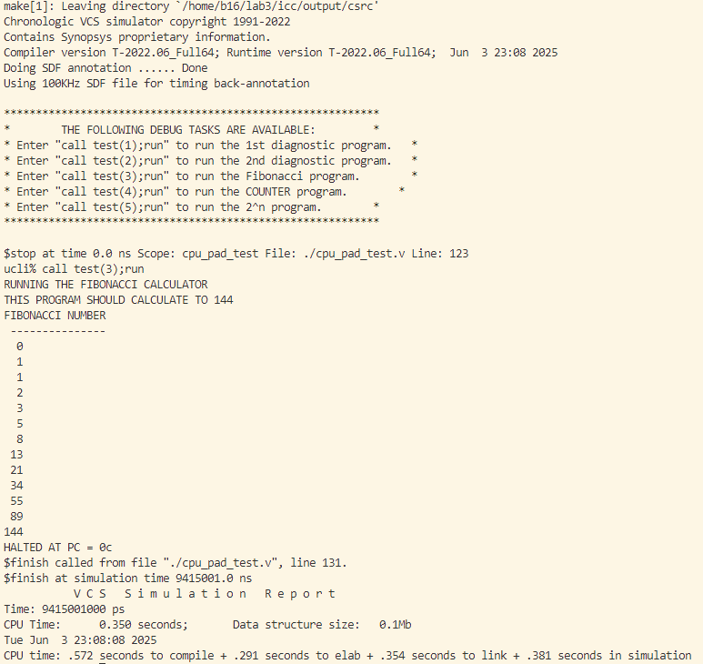

<!--
 * Copyright (c) 2025 by Albresky, All Rights Reserved. 
 * 
 * @Author: Albresky albre02@outlook.com
 * @Date: 2025-05-19 14:48:17
 * @LastEditTime: 2025-06-03 23:16:44
 * @FilePath: /BUPT-EDA-Labs/lab3/README.md
 * 
 * @Description: 
-->

# 实验结果

>1. 利用实验二产生的门级网表和SDC文件，参考示例设计，采用EDA版图设计工具进行版图设计，输出版图后门级电路。

**design_setup 后的时序结果**:


**floorplan 后的版图**:



**placement 后的版图**:


**CTS 时钟树综合后的版图**:


**route 后的版图**:




>2. 对生成的版图进行寄生参数提取。



>3. 利用PT把SPEF文件变换成SDF格式。


>4. 反标 SDF 过程中遇到的问题。

- **1.`scale_mux.v` 找不到**

lab2 的 syn 综合报 warning、 lab3 的 design_setup 报 error

`scale_mux.v` 的 `parameter size` 改成 5，`cpu.v` 的 `scale_mux` 实例去掉 `#5`
```
module scale_mux(out,sel,b,a);
parameter size=5;
output[size-1:0] out;
input[size-1:0]b,a;
input sel;
reg[size-1:0] out;
	always@(sel or a or b)
		if(!sel) out=a;
		else out=b;
endmodule
```

- **2.`tran` 语法非法**

这和 lab2 的门级网表生成时的 tcl 脚本有关，应该禁用 `tran` 语句的生成。

```tcl
set verilogout_no_tri true
```

- **3.仿真时 `user-defined task` 找不到**

lab3 在完成 floorplan、placement、cts、route、spef 之后，最后进行仿真测试时，无法调用 `call task(*)` 

**解决方法：**
在使用 VCS 仿真器进行仿真时，显示声明测试激励的模块顶层为 `cpu_pad_test`:

```tcl
vcs ... \
    -top cpu_pad_test \
    ...
```

- **4.仿真时 `mem` 模块找不到**

在利用 `cpu_pad_test` 行为级代码进行仿真时，vcs 输出找不到 `mem` 模块，这是由于该激励文件中使用 `mem` 进行模块例化，但是没有提供 `mem` 模块的定义。

**解决方法：**
在 vcs 仿真脚本中添加 `filelist.f`：

```tcl
vcs -f filelist.f \
  ... \
  -top cpu_pad_test \
  ...
```

其中，在 `filelist.f` 中声明 `mem` 模块定义文件的相对路径：

```tcl
./mem.v
```

>5. 反标 SDF 结束后，VCS 仿真测试结果（**这里使用的是 100KHz 的 SDF 进行反标**）。

- **测试 1**

仿真结果正确，PC 指针在 addr=17 时成功 halt，当前 PC 指针指向地址 17。



- **测试 2**

仿真结果正确，PC 指针在 addr=10 时成功 halt，当前 PC 指针指向地址 17。


- **测试 3**

仿真结果正确，程序在运行到斐波那契数列数值为 144 时，cpu 成功 halt。

